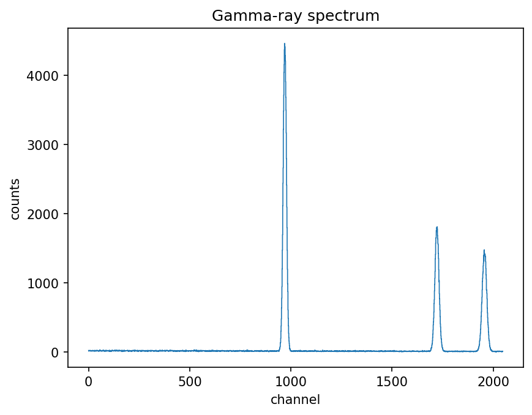

# Gamma-Spectroscopy Analysis Toolkit

A small, well-tested Python toolkit for the everyday tasks of gamma-ray
spectroscopy: finding photopeaks in a multichannel-analyser (MCA) spectrum,
fitting them, calibrating channels to energy from known reference lines, and
reporting the detector's energy resolution.

The emphasis is on being **usable and reproducible by someone other than the
author**: every step is a small, documented, independently testable function,
and the whole workflow can be driven from a command line with a single
configuration file.



## What it does

Given a spectrum (a `channel counts` text file), the toolkit will:

1. **detect** candidate peaks above the continuum;
2. **fit** each one with a Gaussian on a linear background to get a precise
   sub-channel centroid and width;
3. **calibrate** the channel axis to energy using peaks of known energy
   (e.g. the 661.66 keV line of ¹³⁷Cs and the 1173.23 / 1332.49 keV lines of
   ⁶⁰Co);
4. **report** each peak's energy and the relative energy resolution
   (FWHM / energy).

## Requirements

- Python **3.11 or newer** (the configuration file is parsed with the
  standard-library `tomllib`).
- `numpy`, `scipy`, `matplotlib` — all standard in the scientific-Python stack.

It has been developed and tested on Linux with CPython 3.12; no other platform
constraints are known.

## Installation

```bash
git clone <your-repository-url>
cd gamma-spectroscopy-toolkit
pip install -e .
```

To also install the test dependencies (`pytest`, `hypothesis`, `coverage`):

```bash
pip install -e ".[test]"
```

## Quick start

```bash
# 1. create a reproducible synthetic Cs-137 / Co-60-like spectrum to try things on
gamma-toolkit generate --output examples/example_spectrum.csv --seed 42

# 2. analyse it using the bundled configuration
gamma-toolkit analyze --config config/example_config.toml --plot plots/
```

The second command prints a report like:

```
detected and fitted 3 peak(s):

 centroid (ch)  sigma (ch)  energy (keV)  resolution (%)
        970.01        8.08        661.74            1.95
       1721.95        9.92       1172.91            1.35
       1957.04       11.08       1332.73            1.33

calibration: energy = 2.3131*ch^0 + 0.67981*ch^1
```

and writes the figures (`spectrum.png`, one `peak_N.png` per peak, and
`calibration.png`) into `plots/`.

## Documentation

The documentation is split following the [Divio system](https://www.divio.com/blog/documentation/)
(learning / task / reference / understanding):

- **[Tutorial](docs/tutorial.md)** — a first, hands-on run from an empty folder
  to a calibrated spectrum.
- **[How-to guides](docs/how-to.md)** — recipes for using your own data,
  writing a config, and calling the library from Python.
- **[Reference](docs/reference.md)** — every public function, its parameters
  and defaults.
- **[Explanation](docs/explanation.md)** — the physics and the design choices:
  the peak model, the calibration assumptions, and why the code is organised
  the way it is.

## Running the tests

```bash
pip install -e ".[test]"
coverage run -m pytest      # run the suite
coverage report -m          # show line/branch coverage
```

The suite covers every user-facing function (the plotting module excepted, as
it only draws already-computed data) and reaches 99% branch coverage.

## Project layout

```
gammalib/        the library (one module per responsibility)
tests/           the test suite (one file per library module)
config/          an example TOML configuration
examples/        a small, reproducible example spectrum
docs/            tutorial, how-to, reference and explanation
```

## Licence

Released under the MIT Licence — see [LICENSE](LICENSE).
