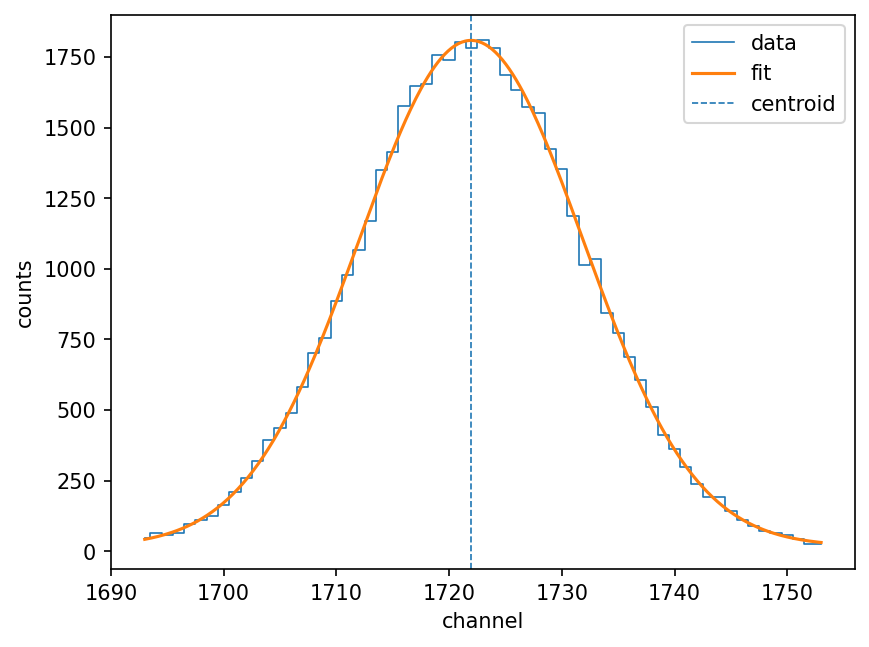
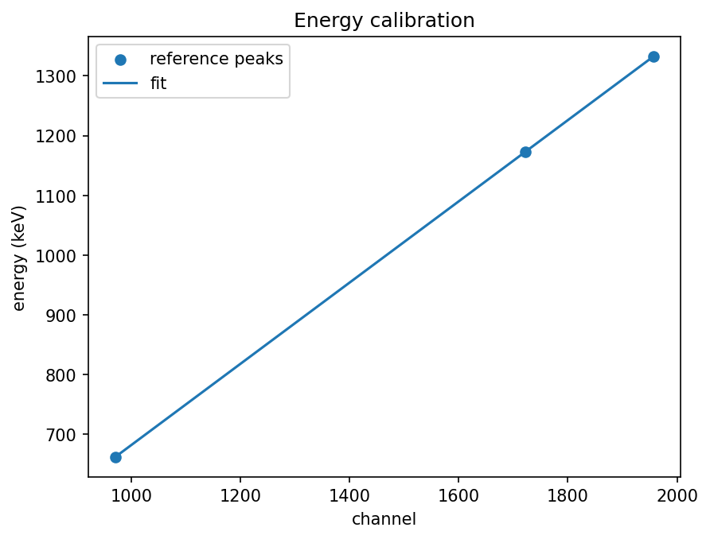

# Tutorial: your first calibrated spectrum

This walkthrough takes you from a freshly cloned repository to a fully
calibrated gamma-ray spectrum in a few minutes. You do not need any data of
your own: the toolkit can generate a realistic example for you.

By the end you will have detected three photopeaks, fitted them, turned the
channel axis into an energy axis, and read off the detector's resolution.

## Step 0 — install

From the project root:

```bash
pip install -e .
```

This makes the `gamma-toolkit` command available.

## Step 1 — generate an example spectrum

Real detector data is not shipped with the toolkit, so we make our own. The
generator produces a spectrum that mimics a measurement of a ¹³⁷Cs + ⁶⁰Co
source: three Gaussian photopeaks sitting on a Compton-like continuum, with
realistic Poisson counting noise.

```bash
gamma-toolkit generate --output examples/example_spectrum.csv --seed 42
```

The `--seed` makes the result **reproducible**: run it again with the same seed
and you get exactly the same file, byte for byte. Open the file if you are
curious — it is just two columns, `channel` and `counts`:

```
# channel counts
0 24
1 14
2 19
...
```

## Step 2 — look at the configuration

Everything the analysis needs lives in one file, `config/example_config.toml`.
The important parts are:

```toml
[input]
spectrum_file = "../examples/example_spectrum.csv"

[peak_detection]
min_prominence = 200.0   # how far a peak must stand out to be counted
min_distance   = 20      # minimum gap between two peaks, in channels

[fitting]
window_half_width = 30   # channels used on each side of a peak when fitting

[calibration]
degree = 1               # straight-line channel -> energy mapping
reference_energies = [661.66, 1173.23, 1332.49]   # the known lines, in keV
```

The three `reference_energies` are the true energies of the ¹³⁷Cs and ⁶⁰Co
lines. They are matched to the detected peaks **in order of channel**, so the
number of entries must equal the number of peaks that are found.

## Step 3 — run the analysis

```bash
gamma-toolkit analyze --config config/example_config.toml --plot plots/
```

You should see:

```
detected and fitted 3 peak(s):

 centroid (ch)  sigma (ch)  energy (keV)  resolution (%)
        970.01        8.08        661.74            1.95
       1721.95        9.92       1172.91            1.35
       1957.04       11.08       1332.73            1.33

calibration: energy = 2.3131*ch^0 + 0.67981*ch^1
```

Read this from left to right: each detected peak's centroid (to a fraction of a
channel), its Gaussian width, the **energy** the calibration assigns to it, and
the **resolution** — the peak's FWHM as a percentage of its energy. The last
line is the fitted calibration: energy in keV as a function of channel number.

Notice that the recovered energies (661.74, 1172.91, 1332.73 keV) sit right on
top of the true lines we asked for. That is the calibration doing its job.

## Step 4 — look at the pictures

The `--plot plots/` option saved several figures:

- `plots/spectrum.png` — the whole spectrum;
- `plots/peak_0.png`, `peak_1.png`, `peak_2.png` — each fit over its data;
- `plots/calibration.png` — the calibration line through the reference points.

A fitted peak looks like this — the data (steps), the model (smooth curve), and
the fitted centroid (dashed line):



And the calibration is a clean straight line through the three reference points:



## Where to go next

- To use **your own** spectrum instead of the synthetic one, see the
  [how-to guides](how-to.md).
- To understand *why* the peak model and calibration look the way they do, read
  the [explanation](explanation.md).
